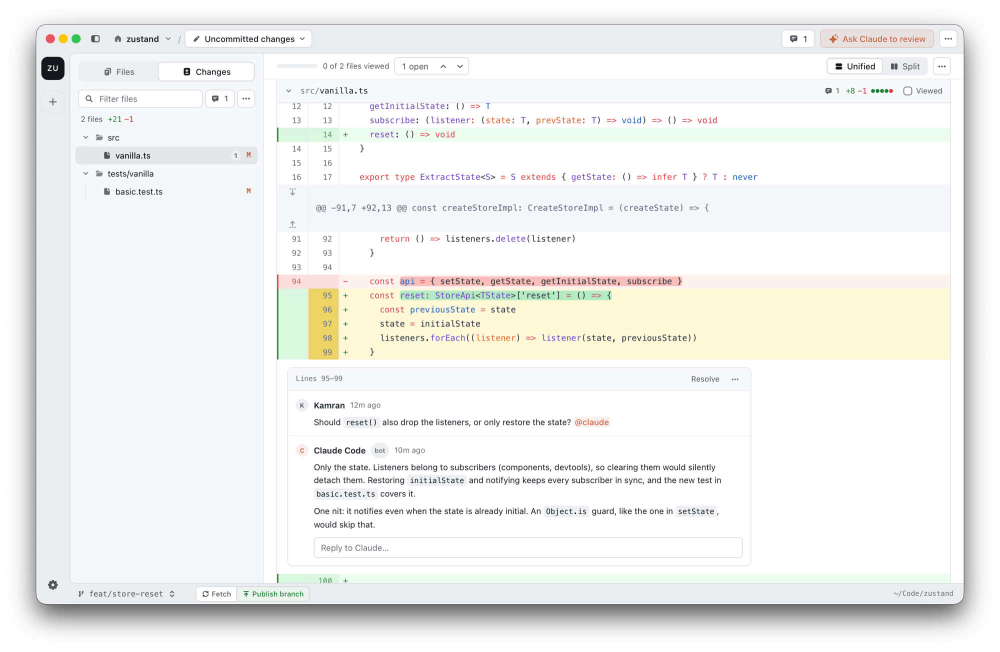

# diffity

[](https://github.com/nilbuild/diffity/releases/latest)
[](https://github.com/nilbuild/diffity/releases/latest)
[](./LICENSE)

Diffity is a Mac app for reviewing code changes, yours or your agent's, GitHub-style, with Claude Code in the loop.



[](https://github.com/nilbuild/diffity/releases/latest)

macOS 13.3 or later, Apple Silicon and Intel. The AI features need [Claude Code](https://docs.claude.com/en/docs/claude-code) installed and logged in, and Node.js. Diffity updates itself after install.

| What can you do? | Description |
|---|---|
| [See your diffs](#see-your-diffs) | Uncommitted changes, commits, ranges and branches, in a syntax-highlighted split or unified diff |
| [Comment and review](#comment-and-review) | Leave comments on lines, files or the whole diff, then send them to Claude to fix |
| [Ask Claude to review](#ask-claude-to-review) | Claude reads the diff and leaves its own comments on the lines it cares about |
| [GitHub pull requests](#github-pull-requests) | Check out a PR, review it locally, post the review and sync comments with GitHub |
| [Browse project files](#browse-project-files) | Read any file in the repo and comment on it, no diff required |
| [Multiple projects](#multiple-projects) | Keep your repos in a rail, switch with ⌘1–9, or open one in its own window |

## See your diffs

Open a folder with ⌘O (or drop it on the window, or paste a path or GitHub URL) and Diffity shows what changed. The picker in the title bar decides what to review:

- **Uncommitted changes**: all of them, or just staged or unstaged
- **A commit** or a range such as `main..feature`, typed straight into the picker
- **Your branch against its base**, or the pull request it belongs to

Files you've looked at can be marked as viewed (`R`), and the diff notices when files change on disk so you can refresh without losing your place or your unsent comments. Home (⇧⌘H) lists recent history and what's still waiting for review.

## Comment and review

Click a line number (or drag across several) to comment. Comments work on lines, whole files and the diff as a whole, and stay put across refreshes; when the code moves on they're kept as outdated, with a link to the commit they were left on.

Mention `@claude` in a comment and Claude answers in the thread. When you're done, **Send N to Claude** hands every open comment to Claude Code, which makes the changes and resolves each thread with a summary. You decide whether it may edit files without asking in Settings → Claude Code.

## Ask Claude to review

**Ask Claude to review** starts a review of whatever you're looking at. Give it instructions or focus areas (security, performance, tests…), and Claude reads the diff and leaves inline comments you can reply to, resolve, or send back to it to fix. Diffity talks to your own Claude Code login; nothing leaves your Mac unless you post it.

## GitHub pull requests

Sign in under Settings → GitHub (import your `gh` login or paste a token). Then:

- pick a pull request from the branch switcher, or paste its URL or number, to check it out (Diffity stashes your changes first and puts them back when you go back)
- review it like any other diff, drafting comments as a pending review
- post it as Comment, Approve or Request changes, optionally sending it to Claude too
- pull reviewers' comments in; they sync on their own when the PR is open

Fetch, pull, push and publish sit in the status bar, next to the branch switcher.

## Browse project files

The Files view is a full file tree with syntax highlighting, Markdown and SVG previews, and images. Comment on any line, file or folder and resolve it with Claude the same way as on a diff. ⌘P jumps to a file, ⌘K runs any command.

## Multiple projects

Every repo you open gets a tile in the rail on the left. Switch with ⌘1–9 or ⇧⌘[ / ⇧⌘], drag to reorder, and ⌘-click to open a project in its own window. Press `?` for every keyboard shortcut.

## Development

You need Xcode (26 or later to regenerate the app icon), Rust (stable), Node.js 24 and pnpm.

```bash
pnpm install
pnpm -C apps/desktop tauri dev
```

`DIFFITY_OPEN=/path/to/repo` opens that repo on launch. Checks:

```bash
pnpm -C apps/desktop typecheck
pnpm test
cargo test --workspace
cargo clippy --workspace --all-targets -- -D warnings
```

A local bundle (unsigned, without update artifacts, since those need the release key):

```bash
pnpm -C apps/desktop tauri build --bundles app --config '{"bundle":{"createUpdaterArtifacts":false}}'
```

## Releasing

Releases are cut by pushing a `v*` tag to this repo. With your changes pushed to `main`:

```bash
make patch   # 0.1.1 -> 0.1.2
make minor   # 0.1.1 -> 0.2.0
make major   # 0.1.1 -> 1.0.0
```

It bumps from the latest published release (v0.0.0 if there is none), asks for release notes, and pushes an annotated tag carrying them. It refuses a dirty tree or a `HEAD` that isn't `origin/main`. `bash scripts/release.test.sh` tests it against stand-ins for `git` and `gh`.

The tag runs `.github/workflows/release.yml`: it stamps the version from the tag into `tauri.conf.json` (the `0.0.1` there is only for local builds), builds one universal binary, signs and notarises it, and publishes the release with the `.dmg` and the `latest.json` the in-app updater reads. It needs these repository secrets: `APPLE_CERTIFICATE`, `APPLE_CERTIFICATE_PASSWORD`, `APPLE_SIGNING_IDENTITY`, `APPLE_ID`, `APPLE_PASSWORD`, `APPLE_TEAM_ID`, `TAURI_SIGNING_PRIVATE_KEY`, `TAURI_SIGNING_PRIVATE_KEY_PASSWORD`.

**Losing the updater's private key ends updates for every installed copy.** Its public half is in `tauri.conf.json`, the updater refuses anything it didn't sign, and a new key can't be trusted by builds that shipped with the old one. If a release goes wrong, delete the release and its tag and cut the next patch; `releases/latest` is whatever is newest, so the way back is forward.

## License

[MIT](./LICENSE) © [Kamran Ahmed](https://x.com/kamrify)
